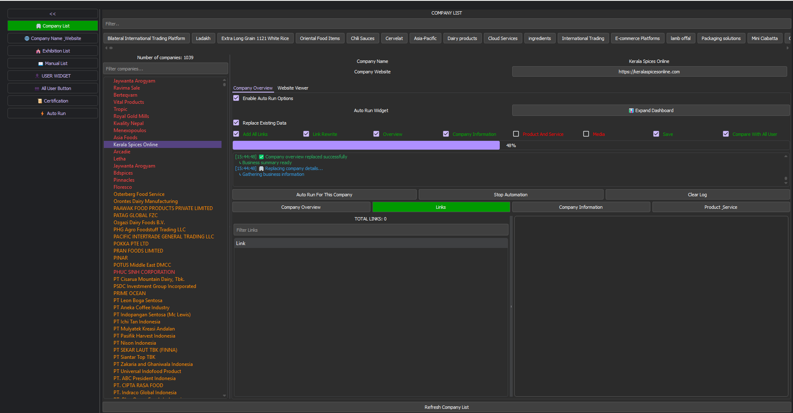

# First Main Widget Documentation

## Functional Requirements
1. Collapsible sidebar (300px ↔ 80px)
2. 8 navigation buttons with icons
3. Content panel switching
4. Active state highlighting
5. Tooltips in collapsed mode

## Technical Requirements
- Pure HTML/CSS/JavaScript
- Responsive design
- Cross-browser compatibility
- Smooth animations

## Button Specifications
1. 🏢 Company List (green active state)
2. 🌐 Company Name & Website
3. 🎪 Exhibition List
4. 📖 Manual List
5. 👤 USER WIDGET
6. 👥 All User Button
7. 📜 Certification
8. ⚡ Auto Run

## Default State Management

1. First button (Company List) should be active by default
2. First content panel should be visible on page load

## Animation Details
- Sidebar toggle: 0.3s ease-in-out
- Button hover: 0.2s ease-in-out
  - Content panel switch: 0.3s fade-in

